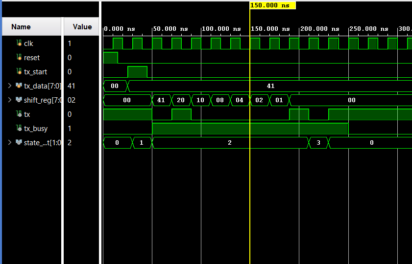
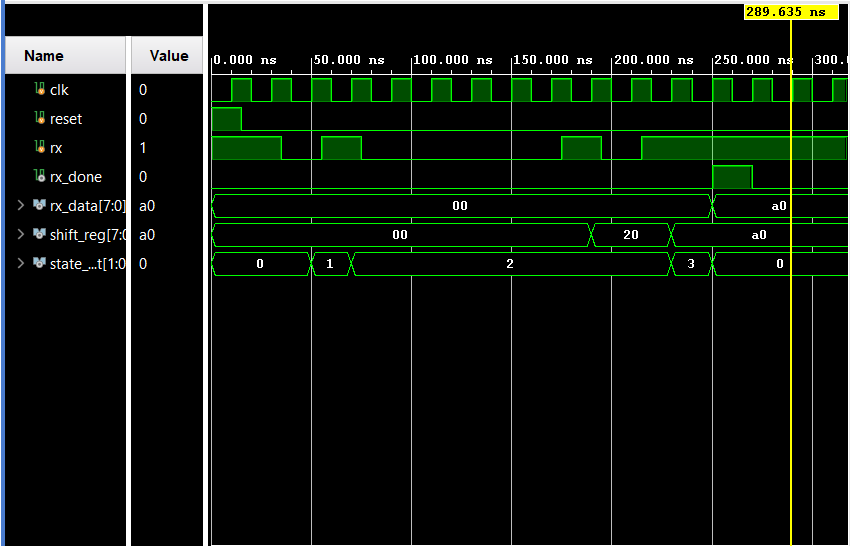

# UART-8-BIT

## Overview

This project implements an 8-bit UART (Universal Asynchronous Receiver Transmitter) Transmitter and Receiver in Verilog HDL. The design uses Finite State Machines (FSMs), shift registers, and bit counters to perform serial communication. Both modules follow the UART frame format consisting of IDLE, START, DATA, and STOP states and have been verified through simulation.

---

## Features

### UART Transmitter (UART TX)
- 8-bit parallel-to-serial data transmission
- FSM-based control
- Start bit generation
- LSB-first data transmission
- Stop bit generation
- Shift register based serialization
- Bit counter for tracking transmitted bits

### UART Receiver (UART RX)
- 8-bit serial-to-parallel data reception
- FSM-based control
- Start bit detection
- LSB-first data reception
- Stop bit verification
- Shift register based deserialization
- Bit counter for tracking received bits
- Receive complete indication (`rx_done`)

---

## UART Frame Format

```text
| Start Bit | 8 Data Bits (LSB First) | Stop Bit |
|     0     |   b0 b1 b2 ... b7       |     1    |
```

---

## FSM States

```text
IDLE → START → DATA → STOP → IDLE
```

### IDLE
Waits for transmission/reception to begin.

### START
Handles the UART start bit.

### DATA
Transmits or receives 8 data bits.

### STOP
Handles the UART stop bit and completes the transaction.

---

## Project Structure

```text
UART-8-BIT
│
├── RTL Design
│   ├── uart_tx.v
│   └── uart_rx.v
│
├── TESTBENCH
│   ├── tb_uart_tx.v
│   └── tb_uart_rx.v
│
├── SIMULATION
│   ├── waveform_TX.png
│   └── waveform_RX.png
│
└── README.md
```

---

## Simulation Results

The UART TX and UART RX modules were verified using custom Verilog testbenches in Vivado Simulator.

### UART TX Waveform



### UART RX Waveform



---

## Concepts Practiced

- Verilog HDL
- Finite State Machines (FSM)
- Sequential Logic Design
- Shift Registers
- Counters
- UART Communication Protocol
- Parallel-to-Serial Conversion
- Serial-to-Parallel Conversion
- RTL Simulation and Verification

---

## Future Improvements

- Baud Rate Generator
- Parity Bit Support
- Framing Error Detection
- UART Loopback Testing
- UART TX-RX Integration

---
## Author
  Madhu Visagan H T
